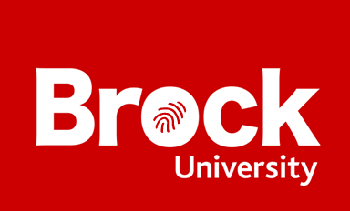 

# 2026 State of Scholarly Publishing Report
Prepared by Brock Library Research Lifecycle Department

# What is this?

A yearly check-in of some scholarly publishing dynamics at Brock University over the 2025/2026 academic year. This report is published as part of [Open Access Week 2026](https://www.openaccessweek.org/theme) celebrations. You can find previous reports on our [Publishing Guide](https://researchguides.library.brocku.ca/getting-your-research-out/state-of-scholarly-publishing).

# Journal articles published

Over the course of July 1, 2025 to June 30, 2026 a total of: **921** articles were published by Brock Researchers.

## Open Access versus Closed

We can divide all journal articles into two categories: _Open Access_ or _Closed_. The Brock Library [website](https://brocku.ca/library/open-access/) explains the dynamics of these differences but the most important detail is that Open Access articles are available to readers **without any payment**! Sometimes a journal charges an article processing charge **(APC)** to  make an article Open Access. This happens for both closed journals with some Open Access content and for totally Open Access journals. 

Sometimes it is possible to **publish an earlier version** of a closed journal article in a place like the [Brock University Digital Repository](https://brocku.scholaris.ca/home) to have it become Open Access. We call this having a Green Open Access Pathway.

Does this sound confusing? Well it is. The following graph show the proportion of closed and Open Access articles published by Brock researchers.

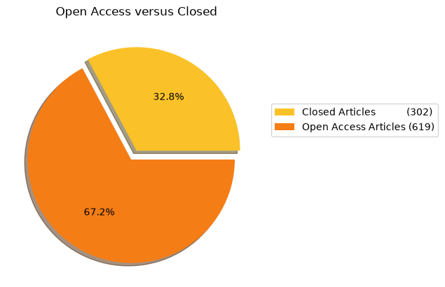

### Colours of Open Access

We can now examine the **different colours** of Open Access journals published. The pie graph below shows the breakdown of these categories. The library website has a description of what these colours mean. In short, diamond is the **best** colour of Open Access as it is _free_ to read, and _free_ to write. No fees are charged for authors who produce content, and there are no subscription fees to read the content. One of the long term goals of librarianship is to convert all Open Access titles to diamond. 

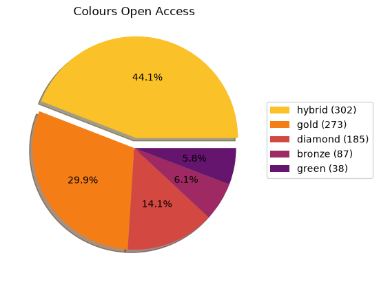

### Green Open Access

When publishing in a closed journal there is often something called a _green pathway_ that will allow the author to either buy out Open Access rights to the article or to allow them to deposit a certain version of their article to the Brock University Digital Repository. The breakdown of what Green pathways exist for Brock author is shown in the following pie graphs.

This means that there is a **free** way to make **85** closed articles Open Access!

### Outreach for Open Access!

The library has developing a program to contact Brock affliated authors of these articles to encourage them to submit an eligible version into the Brock Digital Repository to achieve Open Access. All researchers will need to is copy and paste the DOI of their paper and upload a PDF copy to a [form](https://researchguides.library.brocku.ca/getting-your-research-out/depositing-open-access).

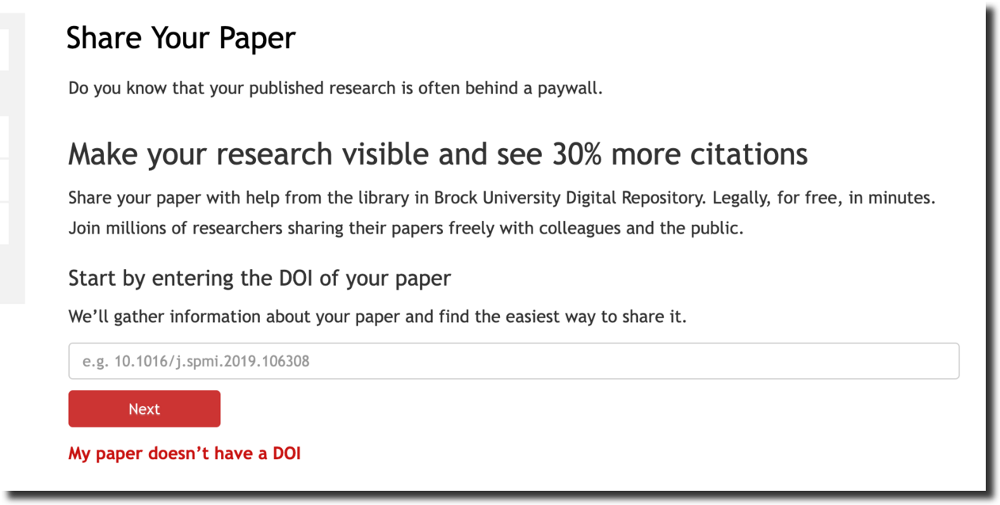

The library will be contacting the authors of _closed_ articles that are eligible with details about how to freely make their articles available.

<!--

#### paid-for Pathways for Closed Articles

As described above we can sometimes achieve Green Open Access by posting a version of an article or by paying a fee. The following graph shows how many of the still Closed papers have at least one paid-for pathway to achieve some version of Open Access. What this means in practice is that the author(s) of the paper can pay a supplimenatary APC after publication to move the paper from Closed to Open Access. This can get expensive however. (APCs data is analyzed littler later on in this report).

#### A Free Pathway for Closed Articles

In contrast, the following graph shows how many Closed papers have at least one _free pathway_ to achieve some version of Open Access. This is great news, by doing a bit of work we can make a bunch of research available Open Access without paying any money.

This means that there is a **free** way to make **188** closed articles Open Access!

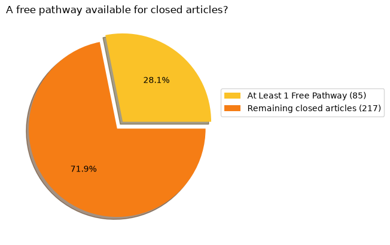

-->

# APCs

As described some publishers enable Open Access through the payment of an additional Article Processing Charge (APC). This is on top of regular subscription costs that the library already pays to get access to the journal.  Sometimes this fee is paid by a research grant, sometimes directly by the researcher. Since research teams span different organizations APC payments might also span different organizations, so it is fair to say these fees weren't all paid out by Brock researchers directly. Some of these fees might of come from _Transformative Agreements_. All figures below are in CAD.

- Total amount spent on APC: **$1,838,999**
- Average (mean) amount paid per APC: **$4,643**
- About **61%** of the published items had an APC that was paid for

## Support for APCs

It is difficult to navigate through all of the components involved with APCs. Brock now has an [APC Discount & Waiver Viewer](https://brock-apc-info.streamlit.app/) that will help explain what titles you can receive relief on. Sometimes there is a full discount! Below is example of the information that that is shown for a journal title.

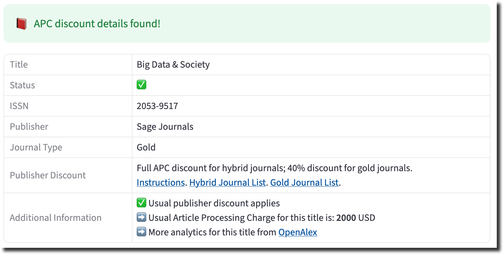

# Some interesting details

Let’s take a closer look at our **921** articles to see if we can find any interesting nuggets.

## Popular Titles and Popular Publishers

Some journal titles are popular with Brock Authors.

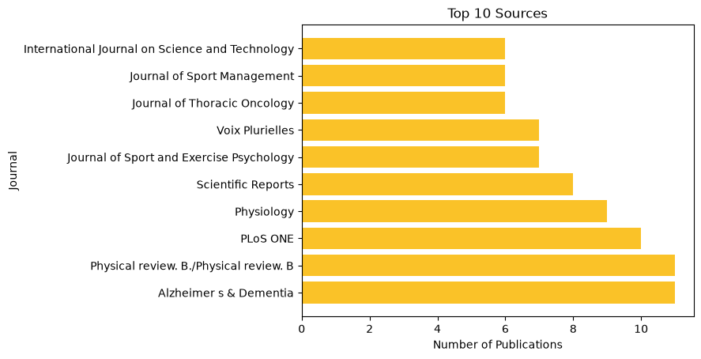

Some publishers also rank high in popularity.

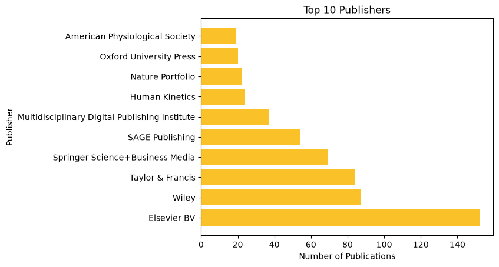

Are these popular publishers producing open access content? We can combine a few things now to see just how open our top publishers are.

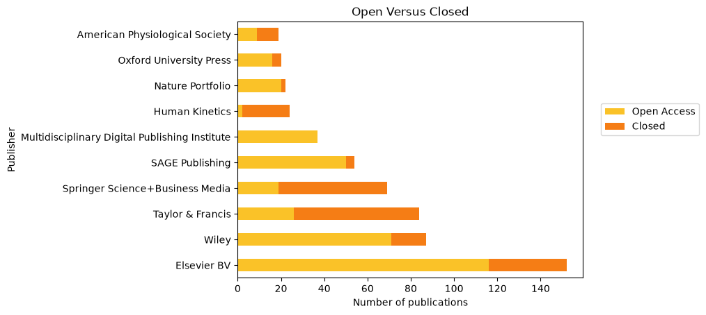

## International Collaborations

We can also discover some interesting details by examining some other characteristics about journal publication metadata. For example, we can see if Brock researchers are collaborating with international partners.

## This Year Versus Last

Since this report is the second of its kind we can track the difference from last year to this year. Looking at number of publications, dollars spent on APCs, and availability of free green pathways we can see the start of some trends.

### Total Publications
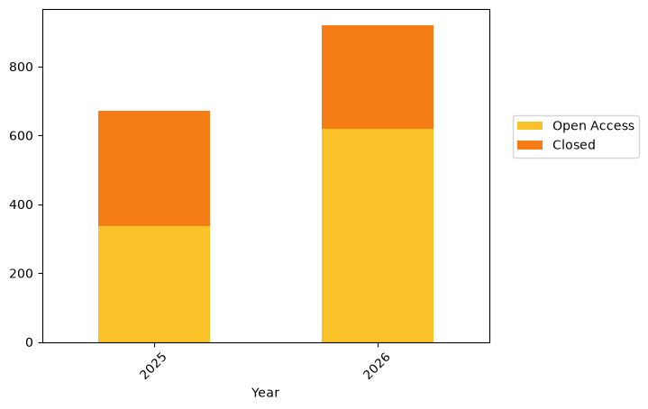

### Total APC Spend in Millions
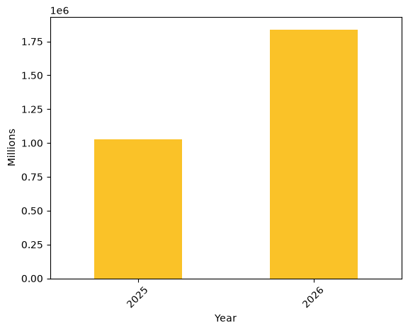

### Proportion of Free Green Pathways Available
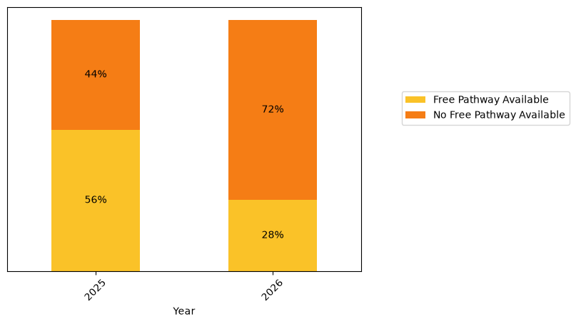

The library has created a [Research Insights Dashboard](https://brock-research-insights.streamlit.app/) that keeps track of even more statistics on Brock publishing. Please check it out.

# How do I get my research out

Please consult our [guide](https://researchguides.library.brocku.ca/getting-your-research-out) that will help you understand how to get the most exposure for your published research. Most importantly you should create an [ORCID iD](https://orcid.org/register) and add **Brock** as your affiliation. These steps are outlined in the guide. When you publish be sure to share your ORCID iD with the journal and your content will automatically get included in this analysis.

# Reproducibility

This data is built with a few assumptions involved and outlined below

- Journal content with a _DOI_ available to _OpenAlex_
- Brock researchers with a _Brock ROR_ in their ORCID record
- This data was retrieved from OpenAlex on _August 25, 2026_

Notebooks and data used to compile this report are freely available [online](https://github.com/elibtronic/2026_state_of_scholarly_communication). If you have an idea for what to add to this report please get in touch.

# Further Information

The data in this analysis was sourced from

[OpenAlex](https://openalex.org/)

[Open Policy Finder](https://openpolicyfinder.jisc.ac.uk/)

- Read the [article](https://doi.org/10.31274/jlsc.21406) from _Journal of Librarianship and Scholarly Communication_ about the 2025 version of this report

- Please contact [Tim Ribaric](https://brocku.ca/library/tim-ribaric/) Scholarly Publishing and Platforms Librarian if you have questions or ideas for this report
